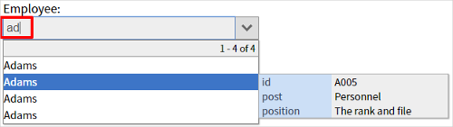

# jquery.ajax-combobox

[](https://www.npmjs.com/package/jquery.ajax-combobox)
[](https://travis-ci.org/sutara79/jquery.ajax-combobox)
[](https://codecov.io/gh/sutara79/jquery.ajax-combobox)
[](https://david-dm.org/sutara79/jquery.ajax-combobox)

jQuery plugin to create a text box which can auto-complete and pull-down-select.



## Demo
http://www.usamimi.info/~sutara/ajax-combobox/


## Install
- [GitHub](https://github.com/sutara79/jquery.ajax-combobox): Clone or download. Only you need is `dist/`.
- [npm](https://www.npmjs.com/package/jquery.ajax-combobox): `npm i jquery.ajax-combobox`
- CDN ([jsDelivr](https://www.jsdelivr.com/)):
    - [jquery.ajax-combobox.min.js (v7.5.0)](https://cdn.jsdelivr.net/npm/jquery.ajax-combobox@7.5.0/dist/js/jquery.ajax-combobox.min.js)
    - [jquery.ajax-combobox.min.css (v7.5.0)](https://cdn.jsdelivr.net/npm/jquery.ajax-combobox@7.5.0/dist/css/jquery.ajax-combobox.min.css)
    - In addition to above, [dist/php/\*.php](https://github.com/sutara79/jquery.ajax-combobox/tree/master/dist/php) is REQUIRED.


## Usage
###### HTML
``` html
<link rel="stylesheet" href="jquery.ajax-combobox.css">

<input type="text" id="foo">

<script src="https://code.jquery.com/jquery-3.2.1.min.js"></script>
<script src="jquery.ajax-combobox.min.js"></script>
```

###### JavaScript
``` javascript
$('#foo').ajaxComboBox('jquery.ajax-combobox.php');
```

## Note
### Database
Change the value to connect DB in `dist/php/jquery.ajax-combobox.php`

``` php
<?php
//++++++++++++++++++++++++++++++++++++++++++++++++++++
//#### You MUST change this value. ####
$mysql = array(
  'dsn'      => 'mysql:host=localhost;dbname=acbox;charset=utf8',
  'username' => 'root',
  'password' => ''
);
$sqlite = array(
  'dsn'      => 'sqlite:../sample/sample.sqlite3',
  'username' => '',
  'password' => ''
);
new AjaxComboBox($sqlite);
//++++++++++++++++++++++++++++++++++++++++++++++++++++
?>
```

## Options
- 1st arg (`string|Object`): Server side file such as PHP. Or an object of data
- 2nd arg (`Object`): Options

##### Combobox
|Option|Type|Initial|Explain|
|:--|:--|:--|:--|
|[lang](http://www.usamimi.info/~sutara/ajax-combobox/sample/basic.html#sample01_07)|string|'en'|Language for this plugin's UI (en, es, pt-br and ja)|
|[db_table](http://www.usamimi.info/~sutara/ajax-combobox/sample/basic.html#sample01_01)|string|'tbl'|Table of database to query|
|field|string|'name'|Field of table to display on result|
|[search_field](http://www.usamimi.info/~sutara/ajax-combobox/sample/basic.html#sample01_04)|string|=field|Field of table to search. Accept comma separated string. (e.g.: `'id, name, job'`)|
|[order_by](http://www.usamimi.info/~sutara/ajax-combobox/sample/basic.html#sample01_06)|mixed|=search_field|Field for sorting (e.g.: `'name DESC'`, `['name ASC', 'age DESC']`)|
|[and_or](http://www.usamimi.info/~sutara/ajax-combobox/sample/basic.html#sample01_05)|string|'AND'|Boolean searching ('AND', 'OR')|
|[per_page](http://www.usamimi.info/~sutara/ajax-combobox/sample/basic.html#sample01_02)|number|10|Amount of items per page|
|[navi_num](http://www.usamimi.info/~sutara/ajax-combobox/sample/basic.html#sample01_02)|number|5|Amount of page-link on navi|
|[navi_simple](http://www.usamimi.info/~sutara/ajax-combobox/sample/basic.html#sample01_03)|boolean|false|Enable simple navi to narrow as possible|
|plugin_type|string|'combobox'|Choose 'combobox', ['simple'](http://www.usamimi.info/~sutara/ajax-combobox/sample/others.html#sample07_01), ['textarea'](http://www.usamimi.info/~sutara/ajax-combobox/sample/text-area.html#sample08_01)|
|[bind_to](http://www.usamimi.info/~sutara/ajax-combobox/sample/others.html#sample06_01)|string|null|Event to run after selecting|
|[button_img](http://www.usamimi.info/~sutara/ajax-combobox/sample/others.html#button-image)|string|[Octicons](https://octicons.github.com/icon/chevron-down/)|Image for "Get All" button. Accept HTML element, src attribute|

##### Sub-info
|Option|Type|Initial|Explain|
|:--|:--|:--|:--|
|[sub_info](http://www.usamimi.info/~sutara/ajax-combobox/sample/sub-info.html#sample02_01)|mixed|false|Display sub-info (true, false, 'simple')|
|[sub_as](http://www.usamimi.info/~sutara/ajax-combobox/sample/sub-info.html#sample02_02)|Object|{}|Alias for fields of sub-info|
|[show_field](http://www.usamimi.info/~sutara/ajax-combobox/sample/sub-info.html#sample02_03)|string|null|Field to display on sub-info. Accept comma separated. ('id, job, age')|
|[hide_field](http://www.usamimi.info/~sutara/ajax-combobox/sample/sub-info.html#sample02_04)|string|null|Field to hide on sub-info. Accept comma separated. ('id, job, age')|

##### Select-only
|Option|Type|Initial|Explain|
|:--|:--|:--|:--|
|[select_only](http://www.usamimi.info/~sutara/ajax-combobox/sample/others.html#sample03_01)|boolean|false|Force only selecting|
|[primary_key](http://www.usamimi.info/~sutara/ajax-combobox/sample/others.html#sample03_02)|string|'id'|Primary-key to use "select only" mode|
|[init_record](http://www.usamimi.info/~sutara/ajax-combobox/sample/others.html#sample04_01)|number|null|Value of primary-key for initial value|
|[instance](http://www.usamimi.info/~sutara/ajax-combobox/sample/others.html#sample07_02)|boolean|false|Return instance instead of jQuery object|

##### Textarea
|Option|Type|Initial|Explain|
|:--|:--|:--|:--|
|[tags](http://www.usamimi.info/~sutara/ajax-combobox/sample/text-area.html#sample08_01)|Array|null|Options for searching tags|
|[tags.pattern](http://www.usamimi.info/~sutara/ajax-combobox/sample/text-area.html#sample08_01)|Array|null|A pair of start symbol and end symbol to surround a tag|
|[tags.space](http://www.usamimi.info/~sutara/ajax-combobox/sample/text-area.html#sample08_02)|Array|[true, true]|Insert space automatically ahead start symbol and behind end symbol|
|[tags.db_table](http://www.usamimi.info/~sutara/ajax-combobox/sample/text-area.html#sample08_05)|string|=db_table||
|[tags.field](http://www.usamimi.info/~sutara/ajax-combobox/sample/text-area.html#sample08_05)|string|=field||
|[tags.search_field](http://www.usamimi.info/~sutara/ajax-combobox/sample/text-area.html#sample08_05)|string|=search_field||
|[tags.order_by](http://www.usamimi.info/~sutara/ajax-combobox/sample/text-area.html#sample08_05)|mixed|=order_by||
|[tags.sub_info](http://www.usamimi.info/~sutara/ajax-combobox/sample/text-area.html#sample08_05)|mixed|=sub_info||
|[tags.sub_as](http://www.usamimi.info/~sutara/ajax-combobox/sample/text-area.html#sample08_05)|Object|=sub_as||
|[tags.show_field](http://www.usamimi.info/~sutara/ajax-combobox/sample/text-area.html#sample08_05)|string|=show_field||
|[tags.hide_field](http://www.usamimi.info/~sutara/ajax-combobox/sample/text-area.html#sample08_05)|string|=hide_field||

##### Shorten URL
|Option|Type|Initial|Explain|
|:--|:--|:--|:--|
|[shorten_btn](http://www.usamimi.info/~sutara/ajax-combobox/sample/text-area.html#sample08_06)|string|null|CSS selector of the button to shoten url|
|[shorten_src](http://www.usamimi.info/~sutara/ajax-combobox/sample/text-area.html#sample08_06)|string|'dist/bitly.php'|Path to the script to shorten url|
|[shorten_min](http://www.usamimi.info/~sutara/ajax-combobox/sample/text-area.html#sample08_06)|number|20|Minimum characters to run shortening url|
|shorten_reg|Object|null|[RegExp](https://developer.mozilla.org/en-US/docs/Web/JavaScript/Reference/Global_Objects/RegExp) object to detect url in the textarea|


## Extensions
- [addComboBox](http://www.usamimi.info/~sutara/sample/addComboBox/)
- [ajaxComboBox_for_CakePHP](https://github.com/sutara79/ajaxComboBox_for_CakePHP)


## Forked
- [jquery.suggest 1.1](http://www.vulgarisoverip.com/2007/08/06/jquerysuggest-11/) (Peter Vulgaris)
- [jquery.caretpos.js 0.1](http://d.hatena.ne.jp/tubureteru/20110101/) (tubureteru)


## License
[MIT](http://www.opensource.org/licenses/mit-license.php)


## Author
[Yuusaku Miyazaki](http://d.hatena.ne.jp/sutara_lumpur/20090124/1232781879)
( <toumin.m7@gmail.com> )
